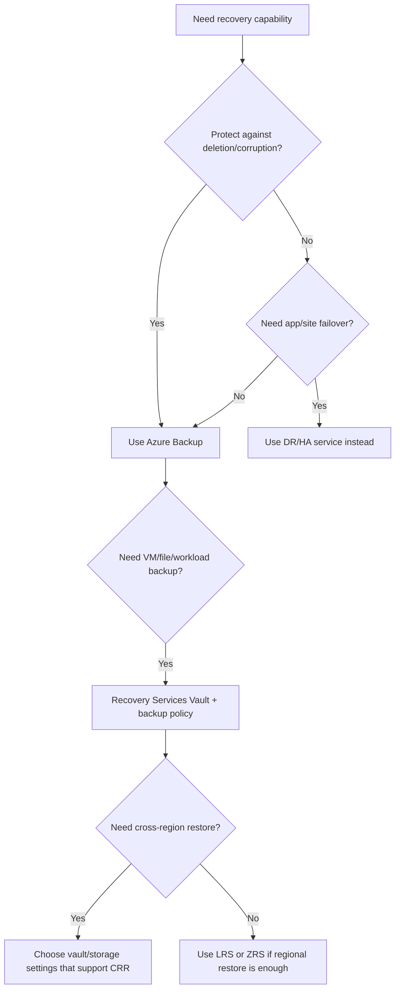
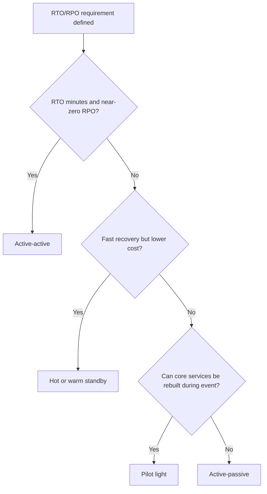

# ♻️ AZ-305: Design Business Continuity Solutions

> **Master overview + cheat sheet + exam prep index** for the AZ-305 domain covering backup, disaster recovery, high availability, and RTO/RPO-driven architecture choices.

---

## 1. AZ-305 Exam Domain Overview

- **Exam weight:** **10-15%**
- **What Microsoft tests:** backup strategy, disaster recovery design, high availability architecture, and how well you align technical choices to **RTO** and **RPO** targets.
- **What the exam rewards:** choosing the **lowest-ops**, **most resilient**, **cost-aware**, and **business-aligned** continuity design rather than the most complex architecture.

### Key skills measured

- Design a solution for backup and disaster recovery
- Design a solution for high availability

### What Microsoft is really asking

| If the scenario says... | Microsoft is testing... |
|---|---|
| Mission-critical, always-on, minimal downtime | High availability + low RTO design |
| Minimal data loss | Low RPO design |
| Recover entire environment after region outage | Disaster recovery |
| Keep costs lower in standby region | Warm standby / pilot light tradeoffs |
| Protect against accidental deletion or ransomware | Backup immutability, soft delete, vault security |
| Cross-region recovery requirement | Geo-replication, cross-region restore, paired-region DR |

> **Exam tip:** **HA** protects against local failures, **DR** protects against major/regional failures, and **backup** protects against deletion, corruption, ransomware, and point-in-time recovery needs.

---

## 2. Services Overview Table

| Service | Category | Best For | RPO | RTO | SLA |
|---|---|---|---|---|---|
| **Azure Backup** | Backup | VM, file, workload backup with centralized policy and recovery | Scheduled; workload-dependent | Minutes to hours | Inherits service design; not an app uptime SLA |
| **Azure Site Recovery (ASR)** | Disaster recovery | Replicating VMs for failover to another region/site | Seconds to minutes | Minutes to hours | No direct app SLA; DR orchestration service |
| **Recovery Services Vault** | Backup/DR management | Central vault for Azure Backup and ASR metadata, policies, recovery points | N/A | N/A | Platform-managed service |
| **Azure Traffic Manager** | Global traffic routing | DNS-based failover across regions/endpoints | Depends on app/data layer | Minutes (DNS TTL dependent) | **99.99%** |
| **Azure Front Door** | Global app delivery | Global HTTP/HTTPS entry, health probes, failover, WAF, acceleration | Depends on backend replication | Seconds to minutes | **99.99%** |
| **Azure Load Balancer** | Regional load balancing | Layer 4 HA for TCP/UDP workloads in one region | N/A | Seconds | **99.99%** |
| **Availability Sets / Zones** | Compute availability | Protecting VMs from host/rack/datacenter failures | Near-zero for node failure scenarios | Seconds to minutes | Up to **99.99%** depending on design |
| **Geo-redundant storage** | Storage resiliency | Durable replicated storage across paired region | Replication lag applies | Minutes to hours for disaster recovery workflows | Durability focused; service SLA varies by storage type |
| **SQL Database geo-replication** | Database DR/HA | Cross-region SQL failover and readable secondary replicas | Typically seconds | Seconds to minutes | Up to **99.995%** for database availability tiers |
| **Cosmos DB multi-region** | Globally distributed database | Low-latency multi-region reads/writes with automatic failover | Near-zero to seconds depending on consistency/write model | Seconds | Up to **99.999%** for multi-region accounts |
| **AKS multi-region** | Container platform resiliency | Regional or multi-region Kubernetes app continuity | App/data dependent | Minutes to hours unless fully active-active | Depends on AKS tier + workload architecture |
| **Azure Business Continuity Center** | Unified management | Single pane for backup, DR, and business continuity across Azure and hybrid resources | N/A | N/A | Preview feature |

### Fast memory map

| Need | Usually choose |
|---|---|
| Point-in-time restore | **Azure Backup** |
| Orchestrated VM failover to another region | **Azure Site Recovery** |
| Global web app failover | **Azure Front Door** |
| DNS-based regional routing | **Traffic Manager** |
| Single-region VM resiliency | **Availability Zones** |
| Durable storage across regions | **GRS / RA-GRS / GZRS** |
| SQL cross-region failover | **Failover groups / active geo-replication** |
| Global distributed NoSQL continuity | **Cosmos DB multi-region** |
| Unified BC management dashboard | **Azure Business Continuity Center** |

### Azure Business Continuity Center (Emerging Feature)

**Azure Business Continuity Center** is a unified management experience that consolidates backup, disaster recovery, and business continuity capabilities across Azure and hybrid environments in a single dashboard.

| Capability | Description |
|---|---|
| **Unified view** | Single pane of glass for all backup and DR resources across subscriptions |
| **Protection status** | At-a-glance visibility into protected vs unprotected resources |
| **Compliance monitoring** | Track backup and DR policy adherence across the organization |
| **Cross-service insights** | Combines Azure Backup, Azure Site Recovery, and native service protection data |
| **Actionable recommendations** | Identifies gaps in protection coverage |

> 💡 **AZ-305 Note:** Azure Business Continuity Center has been evolving and may be in preview or changing release state depending on timing. For exam prep, focus on Recovery Services Vault, Backup Vault, and Azure Site Recovery as the primary management controls, and verify current feature status in Microsoft Learn.

---

## 3. Design Considerations Framework

### Backup Design

- Define **backup frequency** from business tolerance for data loss
- Define **retention** for operational, compliance, and legal requirements
- Choose appropriate **backup type**:
  - **Full**: complete restore point, larger backup window/storage
  - **Incremental**: stores changes since last backup, common in Azure Backup
  - **Differential**: stores changes since last full backup, faster restore than many incrementals in some platforms
- Select backup storage redundancy:
  - **LRS** for lowest cost, same region only
  - **ZRS** for zonal resilience in-region
  - **GRS** for cross-region durability
  - **RA-GRS** when secondary read access matters
- Evaluate **cross-region restore** when compliance or resilience requires restore even if primary region is unavailable
- Enable **soft delete**, vault protections, RBAC separation, and MFA/approval controls for destructive actions
- Design backup isolation for ransomware resilience: immutable vault features, locked-down access, separate subscriptions/tenants when justified

### Disaster Recovery Design

- **RTO (Recovery Time Objective):** maximum acceptable downtime before service is restored
- **RPO (Recovery Point Objective):** maximum acceptable data loss measured in time
- Use the lowest-cost pattern that still meets business requirements:
  - **Active-active**: both regions serve traffic; best for very low RTO/RPO, highest cost/complexity
  - **Active-passive**: primary serves traffic, secondary waits; common exam answer for balanced resilience
  - **Pilot light**: minimal core services running in DR site; lower cost, slower recovery
  - **Warm standby**: scaled-down fully deployable environment ready to grow during failover
  - **Hot standby**: near-full-capacity standby environment for fast failover
- Plan **failover** and **failback** procedures before deployment
- Decide whether failover is **automatic** or **manual with approval**
- Test DR regularly with **non-disruptive drills**, runbooks, communication plans, and recovery validation
- Separate control-plane recovery from data-plane recovery in exam scenarios

### High Availability Design

- **Availability Sets**: protect VMs from host/update domain failures within one datacenter style deployment
- **Availability Zones**: protect against datacenter-level failure within a region
- **Regional HA** is for local failures; **multi-region HA/DR** is for large-scale/regional outages
- Use the right load balancing layer:
  - **Azure Load Balancer** for regional L4
  - **Application Gateway** for regional L7/WAF (not in table, but important)
  - **Front Door** for global HTTP/HTTPS failover
  - **Traffic Manager** for DNS-based endpoint routing
- Choose database HA based on platform:
  - SQL Database zone redundancy / failover groups
  - Cosmos DB multi-region replication
  - Storage redundancy options
- Build **application-level resilience** with retries, circuit breakers, idempotency, queue-based decoupling, stateless web tiers, and externalized session state

### Continuity design checklist

- What is the business-approved **RTO**?
- What is the business-approved **RPO**?
- Is the requirement for **backup**, **HA**, or **DR**?
- Is failover needed within a **region** or across **regions**?
- Does the standby environment need to be always on?
- Is the application tier stateless?
- Can the database replicate fast enough to meet the RPO?
- What is the cost ceiling for the secondary environment?

---

## 4. Decision Flowcharts

### Which backup solution?

### DR pattern selection

### RTO/RPO to architecture mapping

| RTO / RPO target | Likely architecture pattern | Typical services |
|---|---|---|
| **Seconds / near-zero** | Active-active | Front Door + multi-region app + Cosmos DB multi-write / replicated SQL pattern |
| **Minutes / seconds-to-minutes** | Hot standby | ASR, Front Door, SQL failover groups, zone-redundant services |
| **< 1 hour / < 15 minutes** | Warm standby | Scaled-down secondary region, Traffic Manager or Front Door, replicated data |
| **Several hours / hours** | Pilot light | Core data/services replicated, app tier deployed on failover |
| **Day-scale / point-in-time restore acceptable** | Backup and restore only | Azure Backup, storage snapshots, database PITR |

> **Exam shortcut:** lower **RTO/RPO** almost always means higher cost, more automation, more replication, and more operational discipline.

---

## 5. Cheat Sheet Navigation

| Topic | File | Covers |
|---|---|---|
| Backup & Recovery | `Azure-Backup.md` | Azure Backup, vaults, policies, restore |
| Disaster Recovery | `Azure-DR.md` | Site Recovery, failover, DR patterns, RTO/RPO |
| High Availability | `Azure-HA.md` | Availability Zones, multi-region, load balancing |

---

## 6. Labs Navigation

| Topic | File | Labs |
|---|---|---|
| Backup Labs | `Labs/Azure-Backup-Labs.md` | VM backup, SQL backup, file recovery |
| DR Labs | `Labs/Azure-DR-Labs.md` | ASR setup, failover testing, DR drills |
| HA Labs | `Labs/Azure-HA-Labs.md` | Multi-region deployments, Traffic Manager |

---

## 7. Quick Reference Trigger Table

| Trigger phrase in the exam | Think first | Why |
|---|---|---|
| Minimal data loss | **Low RPO** | Data replication frequency matters most |
| Minimal downtime | **Low RTO** | Fast failover matters most |
| Accidental deletion | **Backup / soft delete** | HA does not fix deleted data |
| Ransomware recovery | **Immutable backup + security controls** | Need protected recovery points |
| Region outage | **DR / cross-region failover** | Zonal HA is not enough |
| Datacenter outage in one region | **Availability Zones** | In-region fault isolation |
| Host maintenance impact | **Availability Set / Zones** | Protect against update/fault domains |
| Global web app failover | **Front Door** | Layer 7 global failover and acceleration |
| DNS-based endpoint routing | **Traffic Manager** | Routes by DNS, not proxy |
| TCP/UDP regional balancing | **Load Balancer** | L4 regional service |
| Web app + WAF + regional routing | **Application Gateway** | Regional L7 routing |
| VM replication to another region | **Azure Site Recovery** | DR for machines |
| Point-in-time restore | **Azure Backup / PITR** | Restore to earlier state |
| Central backup policies | **Recovery Services Vault** | Managed backup governance |
| Need readable secondary storage | **RA-GRS** | Read access to secondary |
| Need zonal + regional storage resilience | **GZRS** | Zone + geo protection |
| SQL regional failover | **Failover group / geo-replication** | Database continuity |
| Multi-region NoSQL app | **Cosmos DB multi-region** | Native global distribution |
| Session state causing failover issues | **Externalize session** | Stateless app tiers fail over easier |
| Need lower-cost DR region | **Warm standby or pilot light** | Cost/resilience tradeoff |
| Always-on critical app | **Active-active** | Highest resiliency, highest complexity |
| Manual business approval before failover | **Controlled failover runbook** | Governance/compliance requirement |
| Regular resilience validation | **DR drills / test failover** | Recovery plans must be tested |
| Cross-region restore requirement | **Backup redundancy + CRR** | Backup design, not just replication |
| Secondary region only during disaster | **Active-passive** | Common balanced design |
| Very short DNS failover expectations | **Lower TTL + Traffic Manager limits** | DNS caching affects failover time |
| Zero trust for backup admins | **Separate RBAC + MFA + approval** | Prevent malicious deletion |
| SLA question | **Service uptime ≠ data protection** | Backup/DR solve different problems |
| Zone-redundant PaaS preference | **Built-in zonal services first** | Lower ops than self-managed VMs |
| Failback after outage | **Reverse replication / planned failback** | DR is incomplete without return plan |

---

## 8. AZ-305 Exam Tips and Common Traps

### High-value exam tips

- Start every scenario by identifying whether the requirement is **backup**, **HA**, **DR**, or a combination.
- Translate business language into architecture language:
  - **"little to no data loss"** -> low **RPO**
  - **"back online quickly"** -> low **RTO**
  - **"survive regional outage"** -> cross-region design
- Prefer **platform-managed resiliency** over self-managed complexity when both meet requirements.
- If the app must stay online globally, think **Front Door + multi-region app + replicated data**.
- If the requirement is recovery from deletion/corruption, backups are mandatory even if the app is highly available.

### Common traps

| Trap | Why it is wrong | Better answer |
|---|---|---|
| Choosing backup when the requirement is failover | Backup restores data; it does not keep the app running | Use HA/DR service or pattern |
| Choosing zones for regional disaster recovery | Zones protect inside one region only | Use paired-region or multi-region design |
| Assuming SLA alone solves continuity | SLA is uptime commitment, not recovery design | Map to RTO/RPO and recovery process |
| Recommending active-active for every critical app | Often too expensive/complex for stated needs | Use warm/hot standby when acceptable |
| Forgetting data tier continuity | App failover without database strategy still fails | Design replication/failover for data layer |
| Ignoring DNS TTL with Traffic Manager | DNS caching affects failover speed | Use Front Door if faster app-layer routing is needed |
| Treating GRS as instant app failover | Storage replication does not automatically fail over apps | Pair with DR architecture |
| Ignoring restore testing | Backups are not trustworthy until validated | Regular restore drills |

### Final study focus

1. Memorize the difference between **backup**, **HA**, and **DR**.
2. Be able to map **RTO/RPO** targets to **pilot light / warm standby / hot standby / active-active**.
3. Know the continuity roles of **Azure Backup**, **ASR**, **Front Door**, **Traffic Manager**, **Availability Zones**, **SQL failover groups**, and **Cosmos DB multi-region**.
4. Expect Microsoft to test **tradeoffs**: cost vs resilience, ops vs control, and regional vs global design.
