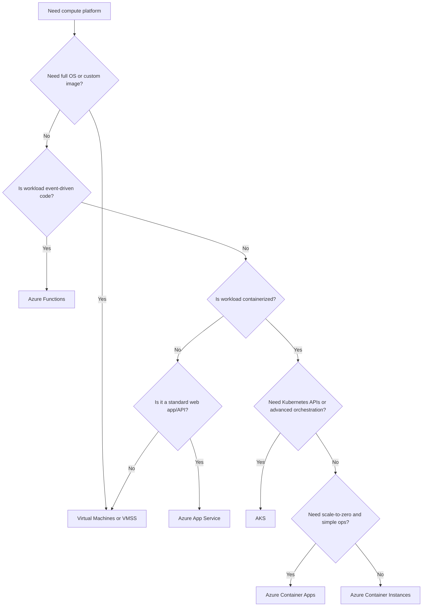
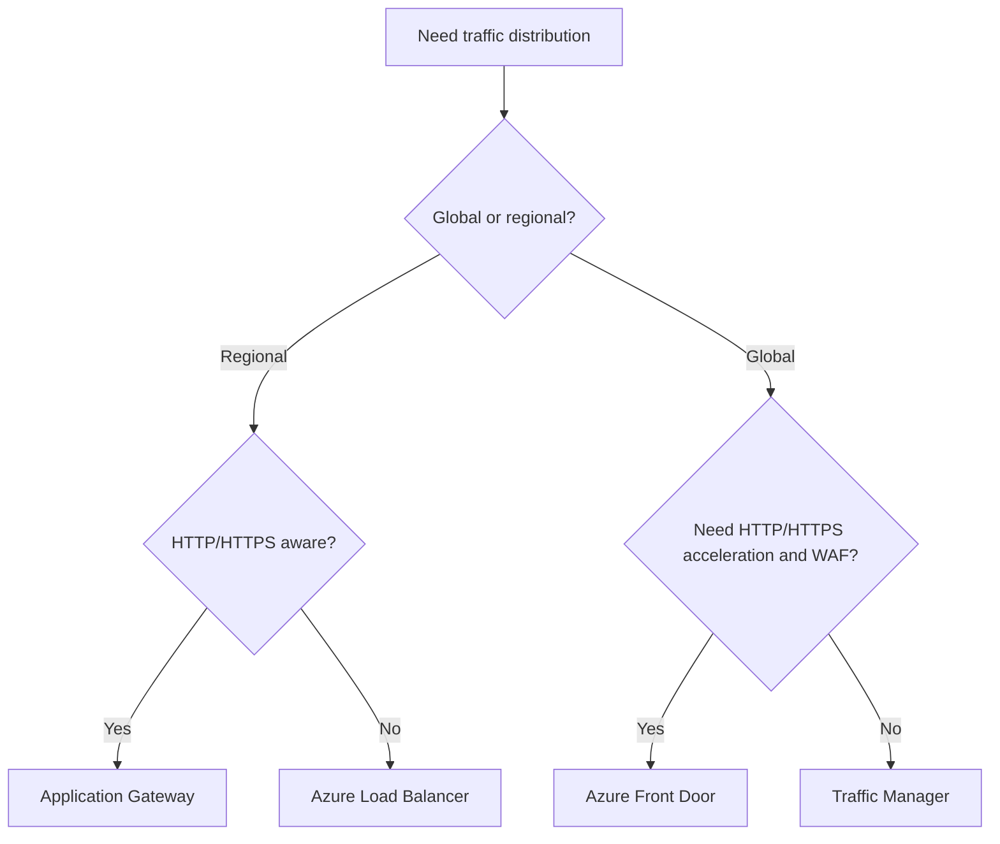
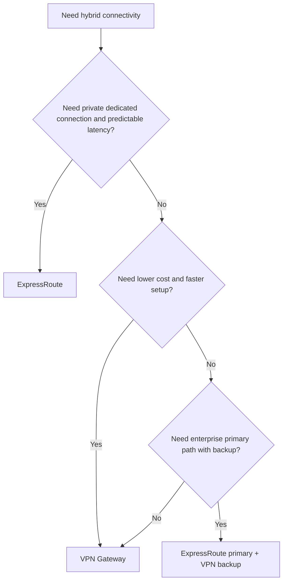
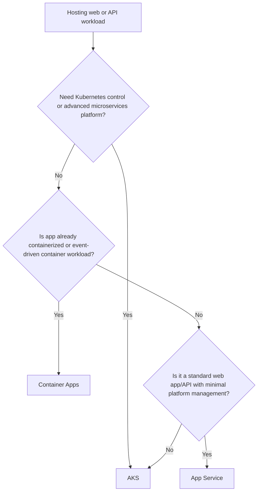

# AZ-305 Design Infrastructure Solutions

> **Master index + cheat sheet + exam prep guide**  
> This domain is **30-35%** of AZ-305 and is the **largest exam area**. If a scenario asks you to choose compute, network, connectivity, scale, availability, or hybrid architecture, this is the domain Microsoft is testing.

---

## 1. AZ-305 Exam Domain Overview

- **Exam weight:** **30-35%** (**largest domain**)  
- **What Microsoft tests:**
  - Compute platform selection
  - Network architecture and connectivity design
  - Load balancing and traffic routing
  - Hybrid and multi-cloud integration patterns
  - High availability, resiliency, and scale decisions
- **Key skills measured:**
  - Select the right compute service for workload requirements
  - Design for scale, elasticity, and fault tolerance
  - Choose between VM, container, PaaS, and serverless options
  - Design virtual networks, segmentation, and secure connectivity
  - Choose the correct load balancing service at regional or global scope
  - Design hybrid connectivity with VPN Gateway, ExpressRoute, Virtual WAN, and Azure Arc
  - Recommend platform services based on cost, operations, security, and performance tradeoffs

### What the exam is really asking

Microsoft rarely asks for definitions only. It usually gives a scenario and expects you to choose the **best-fit service** based on:

- **Management overhead**
- **Scalability requirements**
- **Application architecture**
- **Availability/SLA needs**
- **Security/isolation requirements**
- **Hybrid connectivity requirements**
- **Cost optimization**

### Skills-measured checklist

- [ ] Choose between VMs, VMSS, AKS, App Service, Container Apps, Functions, and ACI
- [ ] Match compute choice to workload type: lift-and-shift, microservices, batch, HPC, event-driven, legacy app
- [ ] Design regional and global load balancing patterns
- [ ] Compare Availability Sets, Availability Zones, and multi-region patterns
- [ ] Design hub-spoke, segmentation, and firewall placement
- [ ] Select hybrid connectivity: site-to-site VPN, point-to-site VPN, ExpressRoute, or Virtual WAN
- [ ] Select hybrid management approach: Azure Arc, Azure Stack HCI, Azure Stack Hub

---

## 2. Services Overview Table

### Compute Services

| Service | Type | Best For | Scaling | SLA |
|---|---|---|---|---|
| **Azure Virtual Machines** | IaaS | Full OS control, legacy apps, custom software, SAP, AD DS, SQL on VM | Manual or autoscale with external tooling | Up to **99.99%** with 2+ VMs across Availability Zones |
| **Virtual Machine Scale Sets (VMSS)** | IaaS fleet | Large sets of identical VMs, autoscaling web/app tiers | Native autoscale by metrics/schedule | High availability with zones/fault domains; aligns with VM deployment model |
| **Azure Kubernetes Service (AKS)** | Managed Kubernetes | Complex containerized apps, microservices, service mesh, advanced orchestration | Pod autoscaling + cluster autoscaling | Control plane has financially backed SLA with paid tier; workload SLA depends on architecture |
| **Azure App Service** | PaaS | Web apps, APIs, enterprise web workloads needing minimal ops | Scale up/out via App Service Plan | **99.95%** |
| **Azure Container Apps** | Serverless containers | Microservices, APIs, background jobs, event-driven container apps | Scale to zero, KEDA-based autoscaling | Backed by platform SLA; best for simplified container operations |
| **Azure Container Instances (ACI)** | Serverless single container/group | Short-lived containers, burst workloads, simple jobs, sandbox workloads | Rapid instance-based scaling, no orchestrator | No built-in orchestration HA pattern |
| **Azure Functions** | FaaS/serverless | Event-driven code, timers, queues, HTTP-triggered lightweight logic | Automatic event-driven scaling | Consumption/Flex/Premium options; SLA depends on hosting plan |
| **Azure Batch** | Managed batch/HPC scheduler | Parallel batch jobs, rendering, simulations, large-scale compute jobs | Pools of compute nodes scale for queued jobs | Depends on pool architecture and node redundancy |
| **Azure Spring Apps** | Managed app platform | Spring Boot / Java microservices with lower platform overhead | Scale app instances | Platform-managed availability; ideal for Spring estates |

### Networking Services

| Service | Category | Best For | Scope | Key Exam Note |
|---|---|---|---|---|
| **Virtual Networks (VNet)** | Core networking | Private IP communication for Azure resources | Regional | Foundation for almost every architecture |
| **Subnets & NSGs** | Segmentation/security | Workload isolation and traffic filtering | Subnet/NIC | NSGs allow/deny traffic; use for micro-segmentation |
| **Azure Firewall** | Managed network security | Centralized L3-L7 filtering, DNAT/SNAT, threat intel | Regional or secured hub | Choose when you need managed centralized filtering |
| **Azure Load Balancer (L4)** | Regional load balancing | TCP/UDP load balancing, internal or public endpoints | Regional | Layer 4 only; use for non-HTTP or ultra-high throughput |
| **Azure Application Gateway (L7)** | Regional web load balancer | HTTP/HTTPS routing, WAF, path-based routing, SSL offload | Regional | Best for web apps needing WAF and L7 routing |
| **Azure Front Door** | Global entry service | Global HTTP/HTTPS acceleration, WAF, CDN-like edge routing | Global | Best for global web apps and active-active routing |
| **Azure Traffic Manager** | DNS-based traffic routing | Global endpoint selection across regions/platforms | Global | DNS routing only; not a proxy |
| **Azure CDN** | Content delivery | Static content acceleration at edge | Global | Best for caching static content close to users |
| **ExpressRoute** | Private connectivity | Dedicated private connection to Azure | Hybrid/global reach options | Higher reliability, predictable latency, private path |
| **VPN Gateway** | Encrypted VPN connectivity | Site-to-site, point-to-site, VNet-to-VNet connectivity | Regional gateway | Faster/cheaper than ExpressRoute, but internet-based |
| **Azure Bastion** | Secure admin access | Browser-based RDP/SSH without public IP on VMs | VNet | Great exam answer for secure admin management |
| **Azure Private Link / Private Endpoints** | Private PaaS access | Private connectivity to PaaS over private IP | VNet-integrated | Keeps traffic off public internet |
| **Azure DNS** | Name resolution | Public or private DNS hosting | Global service | Pair private DNS zones with private endpoints |
| **Virtual WAN** | Branch/global transit | Large-scale branch connectivity and simplified transit networking | Global architecture | Use for many branches/sites and centralized connectivity |

### Hybrid Services

| Service | Type | Best For | Key Value | Key Exam Note |
|---|---|---|---|---|
| **Azure Arc** | Hybrid management/control plane | Managing on-prem, multi-cloud servers, Kubernetes, and data services | Consistent governance and management | Use when resources stay outside Azure but need Azure control plane |
| **Azure Stack HCI** | Hybrid infrastructure platform | Virtualized workloads on-prem with Azure integration | HCI modernization with Azure services tie-in | Best for running virtualization on customer-managed hardware |
| **Azure Stack Hub** | Azure-consistent on-prem cloud | Disconnected/edge/sovereign scenarios requiring local Azure services | Run Azure-consistent services on-prem | Use when apps must run on-prem because of latency/regulation/disconnection |

### Fast comparisons to memorize

| If you need... | Think... |
|---|---|
| Full OS control | **Virtual Machines** |
| A fleet of identical autoscaling VMs | **VMSS** |
| Advanced container orchestration | **AKS** |
| Simplest web app hosting | **App Service** |
| Serverless containers with scale-to-zero | **Container Apps** |
| One-off containers or short jobs | **ACI** |
| Event-driven code execution | **Functions** |
| Massive scheduled parallel jobs | **Batch** |
| Global HTTP routing + WAF | **Front Door** |
| Regional L7 routing + WAF | **Application Gateway** |
| Regional L4 balancing | **Load Balancer** |
| DNS-based global routing | **Traffic Manager** |
| Private dedicated hybrid link | **ExpressRoute** |
| Quick encrypted hybrid connection over internet | **VPN Gateway** |
| Manage servers outside Azure from Azure | **Azure Arc** |

---

## 3. Design Considerations Framework

### Compute Design

#### VM sizing and series selection

- **General purpose**: Balanced CPU/memory for common app servers
- **Compute optimized**: High CPU workloads, web front ends, build servers
- **Memory optimized**: Large in-memory databases, caches, analytics
- **Storage optimized**: High disk throughput/IOPS workloads
- **GPU**: AI/ML, rendering, VDI, high-performance visualization
- **HPC**: Scientific modeling, simulation, MPI workloads

**Exam mindset:** choose the **smallest family that meets technical requirements**, then optimize for performance, region availability, and cost.

#### Spot VMs vs Reserved Instances vs Pay-as-you-go

| Model | Best For | Advantage | Risk/Tradeoff |
|---|---|---|---|
| **Pay-as-you-go** | Variable or short-term workloads | Maximum flexibility | Highest steady-state cost |
| **Reserved Instances** | Predictable long-running workloads | Significant cost savings | Commitment required |
| **Spot VMs** | Interruptible jobs, batch, dev/test | Deep discount | Can be evicted anytime |

#### Availability Sets vs Availability Zones vs VMSS

| Option | Best For | Key Benefit | Limitation |
|---|---|---|---|
| **Availability Set** | Classic single-datacenter resiliency | Protects from host/fault/update domain failures | Not zone-resilient |
| **Availability Zones** | Production HA within a region | Datacenter-level isolation | Not all services/regions support zones |
| **VMSS** | Scale + resiliency for identical VMs | Autoscale and multi-instance management | Requires uniform fleet design |

**Memory aid:**
- **Set** = same region, same datacenter family, fault/update separation
- **Zone** = separate datacenters in region
- **Region pair / multi-region** = disaster recovery level

#### Container orchestration decision

| Requirement | Best Choice |
|---|---|
| Full Kubernetes APIs, advanced orchestration, service mesh | **AKS** |
| Containerized apps without Kubernetes complexity | **Container Apps** |
| Simple single container/group or burst execution | **ACI** |

#### Serverless vs containers vs VMs decision tree

- Choose **Functions** when code is event-driven and short-lived.
- Choose **Container Apps** when app is containerized and you want serverless operations.
- Choose **AKS** when you need Kubernetes-level control.
- Choose **App Service** for standard web apps/APIs without container orchestration complexity.
- Choose **VMs/VMSS** when you need OS control, custom runtimes, domain join, or legacy support.

#### App Service plans and scaling

- **Shared/Basic**: low-scale non-production
- **Standard/Premium**: production apps, autoscale, deployment slots, better performance
- **Isolated/ASE**: high isolation, enterprise network control
- **Scaling concepts**:
  - **Scale up** = bigger instance size
  - **Scale out** = more instances
  - **Autoscale** = metric- or schedule-based

#### Compute for specific workloads

| Workload | Preferred Services |
|---|---|
| Legacy enterprise app | VMs / App Service if compatible |
| Microservices | AKS or Container Apps |
| Event-driven integration | Functions |
| Web app/API | App Service or Container Apps |
| HPC / rendering / simulation | Azure Batch + HPC/GPU VMs |
| SAP-certified deployment | Azure VMs |
| Short burst jobs | ACI or Functions |

### Networking Design

#### Hub-spoke vs mesh topology

| Topology | Best For | Benefit | Tradeoff |
|---|---|---|---|
| **Hub-spoke** | Enterprise landing zones | Centralized security, shared services, simpler governance | Hub can become bottleneck if poorly designed |
| **Mesh** | Smaller environments with many direct dependencies | Lower hop count between peers | Harder to govern and scale |

**Default exam answer:** **hub-spoke** for enterprise, especially with central firewall, DNS, Bastion, and connectivity services.

#### Network segmentation strategies

- Segment by **application tier** (web/app/data)
- Segment by **environment** (dev/test/prod)
- Segment by **trust boundary**
- Use **subnets + NSGs + ASGs + Azure Firewall** together
- Place private endpoints in dedicated or controlled subnets where appropriate

#### Load balancing decision: L4 vs L7, regional vs global

| Need | Choose |
|---|---|
| TCP/UDP balancing only | **Azure Load Balancer** |
| Regional HTTP/HTTPS routing + WAF | **Application Gateway** |
| Global HTTP/HTTPS acceleration + WAF | **Front Door** |
| DNS-level cross-region endpoint routing | **Traffic Manager** |

#### Web Application Firewall placement

- **Front Door WAF**: best for **global** web application protection at edge
- **Application Gateway WAF**: best for **regional** app protection and L7 routing
- Use both in layered designs when global entry and regional inspection are both required

#### DNS design: public vs private zones

| DNS Type | Use For |
|---|---|
| **Public DNS** | Internet-facing names |
| **Private DNS** | Internal name resolution inside VNets and hybrid-connected networks |

**Exam tip:** private endpoints usually require **private DNS zones** for clean name resolution.

#### Hybrid connectivity: ExpressRoute vs VPN decision

| Requirement | Better Choice |
|---|---|
| Highest reliability and predictable private connectivity | **ExpressRoute** |
| Lower-cost faster deployment | **VPN Gateway** |
| Encrypted branch connectivity over internet | **VPN Gateway** |
| Mission-critical enterprise hybrid network | **ExpressRoute** |
| Backup to ExpressRoute | **VPN Gateway** |

#### Network security layers

| Service | Main Role |
|---|---|
| **NSG** | Basic allow/deny filtering at subnet/NIC |
| **ASG** | Simplify NSG rules by grouping NICs logically |
| **Azure Firewall** | Centralized managed filtering, DNAT/SNAT, application/network rules |
| **NVA** | Third-party advanced security/network functions |

#### Zero Trust network architecture

- Assume breach
- Minimize implicit trust
- Enforce least privilege network paths
- Prefer **private endpoints**, **Bastion**, **NSGs**, **central inspection**, and **identity-driven access**
- Eliminate public exposure unless required

### High Availability & Scalability

#### Availability Zones architecture

- Use zone-redundant designs for production workloads when supported
- Spread instances across zones for higher availability
- Pair zonal compute with zone-aware load balancing and resilient data services

#### Multi-region deployment patterns

| Pattern | Best For |
|---|---|
| **Active-passive** | DR-focused, lower cost |
| **Active-active** | Global scale, lowest recovery time, highest availability |
| **Pilot light / warm standby** | Faster recovery without full duplicate steady-state cost |

#### Auto-scaling strategies

- Scale by **CPU/memory/request count/queue depth/custom metrics**
- Use **schedule-based scaling** for predictable peaks
- Use **event-driven scaling** for Functions and Container Apps
- Prevent thrash with cool-down periods and sensible thresholds

#### Traffic distribution patterns

- **Regional**: Load Balancer or Application Gateway
- **Global web**: Front Door
- **Global DNS routing**: Traffic Manager
- **Static content**: CDN

---

## 4. Decision Flowcharts

### Which compute service?

### Which load balancer?

### ExpressRoute vs VPN?

### AKS vs Container Apps vs App Service?

---

## 5. Cheat Sheet Navigation

| Topic | File | Covers |
|---|---|---|
| Compute | `Azure-Compute.md` | VMs, VMSS, AKS, App Service, Container Apps, Functions |
| Networking | `Azure-Networking.md` | VNets, Load Balancers, Firewall, ExpressRoute, VPN |
| Hybrid & Multi-Cloud | `Azure-Hybrid.md` | Azure Arc, Stack, hybrid patterns |

---

## 6. Labs Navigation

| Topic | File | Labs |
|---|---|---|
| Compute Labs | `Azure-Compute-Labs.md` | VM deployment, VMSS, AKS, App Service, Functions |
| Networking Labs | `Azure-Networking-Labs.md` | VNets, NSGs, Load Balancer, App Gateway, Firewall |
| Hybrid Labs | `Azure-Hybrid-Labs.md` | Arc-enabled servers, hybrid connectivity |

---

## 7. AZ-305 Exam Tips

### Why this domain matters

- This is the **largest domain** on the exam.
- Many scenario questions combine **compute + networking + resiliency**.
- Microsoft wants the **best architecture decision**, not just a technically valid one.

### Common exam traps

1. **Choosing VMs when a PaaS option clearly reduces management overhead**
2. **Choosing AKS when App Service or Container Apps is enough**
3. **Confusing Traffic Manager with Front Door**
   - Traffic Manager = **DNS-based routing**
   - Front Door = **global HTTP/HTTPS reverse proxy**
4. **Confusing Application Gateway with Load Balancer**
   - App Gateway = **Layer 7**
   - Load Balancer = **Layer 4**
5. **Using VPN when the question emphasizes predictable private performance at enterprise scale**
6. **Ignoring WAF when internet-facing web apps are in scope**
7. **Forgetting private endpoints/private DNS for secure PaaS access**
8. **Choosing Availability Set when the question clearly needs zone isolation**
9. **Ignoring operational overhead in container decisions**
10. **Missing Azure Bastion as the secure admin answer**

### Decision patterns Microsoft expects

| Scenario clue | Likely answer direction |
|---|---|
| “Minimize management overhead” | PaaS / serverless |
| “Need full control of OS” | VMs |
| “Thousands of identical instances” | VMSS |
| “Microservices with Kubernetes requirements” | AKS |
| “Containerized app without K8s complexity” | Container Apps |
| “HTTP routing + WAF” | Application Gateway or Front Door |
| “Global web application” | Front Door |
| “Private dedicated connection” | ExpressRoute |
| “Secure admin access without public IPs” | Bastion |
| “Manage on-prem or AWS/GCP servers via Azure” | Azure Arc |

### Quick memorization aids

- **VM = control**
- **VMSS = many VMs**
- **AKS = complex containers**
- **Container Apps = easy containers**
- **ACI = one-off containers**
- **Functions = events**
- **Load Balancer = L4**
- **Application Gateway = L7 regional**
- **Front Door = global web**
- **Traffic Manager = DNS**
- **ExpressRoute = private enterprise hybrid**
- **VPN Gateway = encrypted internet hybrid**
- **Bastion = no public IP admin**
- **Arc = Azure management outside Azure**

### Last-week review priorities

If time is short, master these first:

1. **AKS vs Container Apps vs App Service vs Functions**
2. **Load Balancer vs Application Gateway vs Front Door vs Traffic Manager**
3. **Availability Sets vs Zones vs multi-region**
4. **ExpressRoute vs VPN Gateway**
5. **Hub-spoke, NSG, Firewall, Bastion, Private Link**
6. **Azure Arc vs Stack HCI vs Stack Hub**

---

## 8. Quick Reference Trigger Table (30+ entries)

| If the scenario says... | Think... | Why |
|---|---|---|
| Need full OS control | **Azure Virtual Machines** | IaaS with complete guest OS control |
| Need many identical VMs that autoscale | **VMSS** | Native scale-out for uniform VM fleets |
| Need enterprise web app with minimal platform management | **App Service** | Managed PaaS for web apps and APIs |
| Need advanced Kubernetes orchestration | **AKS** | Managed Kubernetes control plane |
| Need containerized microservices without K8s overhead | **Container Apps** | Serverless container platform |
| Need one-off container execution | **ACI** | Fast single container/group deployment |
| Need event-driven compute | **Azure Functions** | Trigger-based serverless execution |
| Need large parallel compute jobs | **Azure Batch** | Queue/scheduler-based batch processing |
| Need Spring Boot hosting | **Azure Spring Apps** | Managed Spring platform |
| Need lowest ops for standard web app | **App Service** | Simplest managed web hosting |
| Need scale-to-zero | **Functions or Container Apps** | Consumption-style scaling |
| Need SAP-certified infrastructure | **Azure VMs** | Common SAP production deployment model |
| Need GPU for ML/rendering | **GPU VMs** | Specialized compute acceleration |
| Need HPC cluster patterns | **Azure Batch + HPC VMs** | Parallel and high-performance workloads |
| Need resilient VM deployment across datacenters | **Availability Zones** | Zone-level fault isolation |
| Need protection from host/update failures only | **Availability Set** | Fault/update domain separation |
| Need disaster recovery across regions | **Multi-region design** | Regional failure protection |
| Need web traffic balancing at Layer 4 | **Azure Load Balancer** | TCP/UDP balancing |
| Need regional HTTP routing and WAF | **Application Gateway** | L7 routing + WAF |
| Need global HTTP routing and acceleration | **Azure Front Door** | Edge-based global web entry |
| Need DNS-based global failover | **Traffic Manager** | DNS endpoint selection |
| Need static content caching globally | **Azure CDN** | Edge caching |
| Need central network segmentation | **Subnets + NSGs** | Baseline segmentation and policy |
| Need centralized network filtering | **Azure Firewall** | Managed central firewall service |
| Need third-party network appliance features | **NVA** | Vendor-specific advanced controls |
| Need secure RDP/SSH without public IP | **Azure Bastion** | Browser-based secure admin |
| Need private access to PaaS service | **Private Endpoint / Private Link** | Private IP path to service |
| Need private name resolution for private endpoints | **Private DNS Zone** | Correct private DNS mapping |
| Need branch or site encrypted connectivity quickly | **VPN Gateway** | Internet-based VPN |
| Need private dedicated hybrid circuit | **ExpressRoute** | Private enterprise connectivity |
| Need backup path for ExpressRoute | **VPN Gateway** | Common backup design |
| Need many branches and global transit | **Virtual WAN** | Simplified large-scale connectivity |
| Need enterprise landing zone network | **Hub-spoke** | Centralized shared services/security |
| Need direct peer communication across many small networks | **Mesh** | Direct connectivity pattern |
| Need to manage on-prem servers from Azure | **Azure Arc** | Hybrid governance and management |
| Need Azure-consistent services on-prem in disconnected edge | **Azure Stack Hub** | Run Azure-consistent services locally |
| Need virtualization platform on-prem with Azure integration | **Azure Stack HCI** | Hyperconverged hybrid platform |
| Need web app isolation in enterprise network | **App Service Environment** | Isolated App Service deployment |
| Need container app driven by queue/event scaling | **Container Apps** | KEDA/event-based scale |
| Need HTTP-triggered lightweight integration logic | **Functions** | Ideal for small event/API handlers |
| Need internet-facing web protection | **WAF** | Protect against common web attacks |
| Need public and private DNS separation | **Azure DNS + Private DNS** | Split internet/internal resolution |
| Need least-privilege east-west filtering | **NSGs + ASGs** | App-level traffic restriction |
| Need minimize operations and patching | **PaaS/serverless** | Platform manages infrastructure |
| Need predictable cost savings for steady workloads | **Reserved Instances** | Discount for committed use |
| Workload can tolerate interruptions | **Spot VMs** | Lower cost with eviction risk |
| Need global active-active web app | **Front Door + multi-region backends** | Global routing and failover |
| Need secure app access without public internet | **Private Link + Firewall/NSGs** | Private connectivity pattern |
| Need hybrid governance across Azure, AWS, and on-prem | **Azure Arc** | Multi-cloud resource governance |

---

## Final Study Strategy

Study this domain in four passes:

1. **Compute selection** - know exactly when to pick each compute service
2. **Network service selection** - know which balancing/connectivity/security service fits each scenario
3. **Resiliency patterns** - zone, region, autoscale, failover
4. **Hybrid patterns** - Arc, ExpressRoute, VPN, Virtual WAN, Stack options

If you can answer **"why this service instead of the next closest alternative?"** quickly, you are in strong shape for AZ-305.
